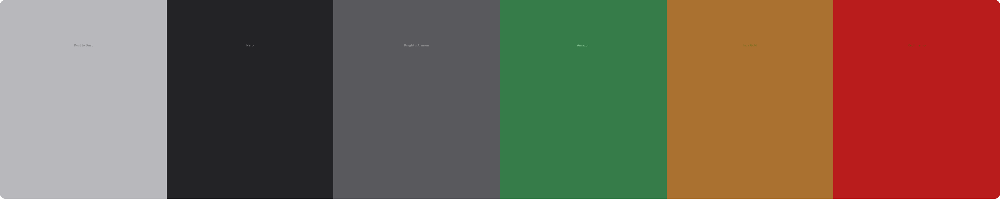
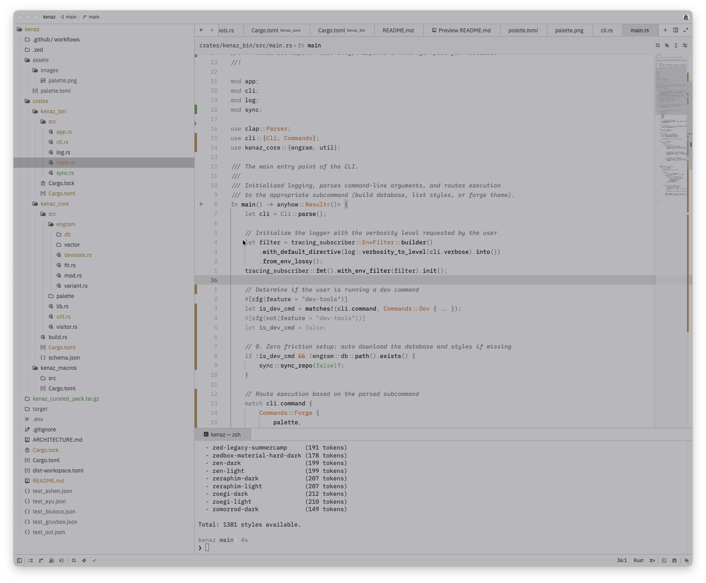
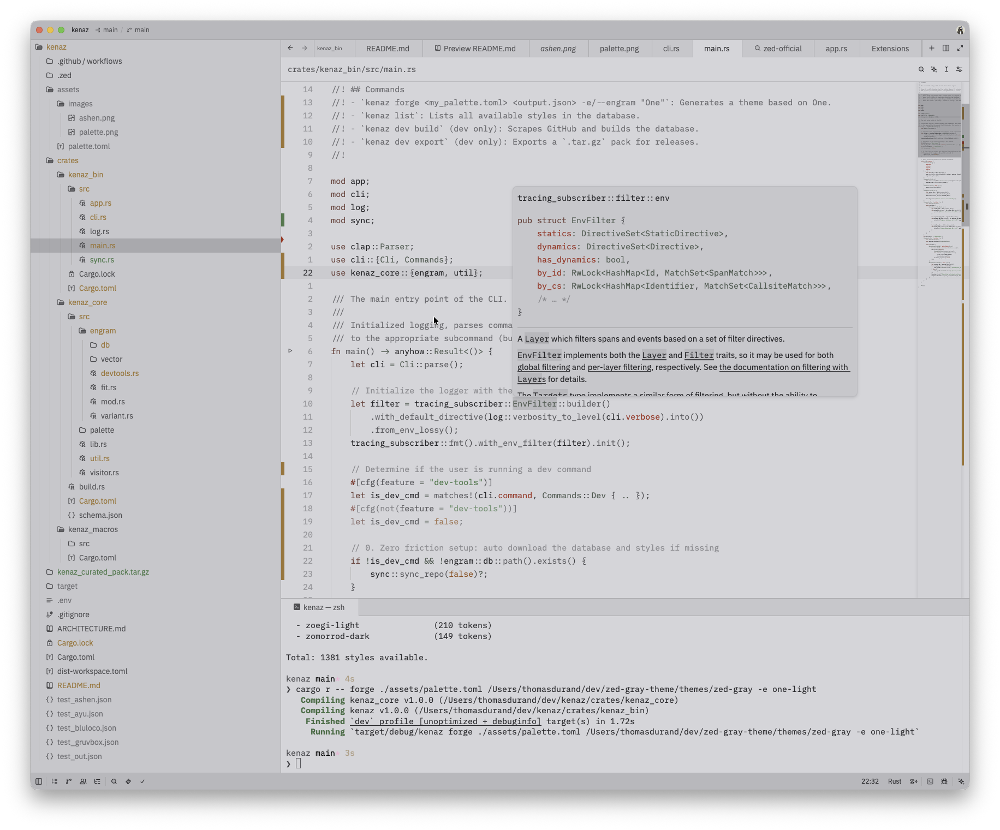
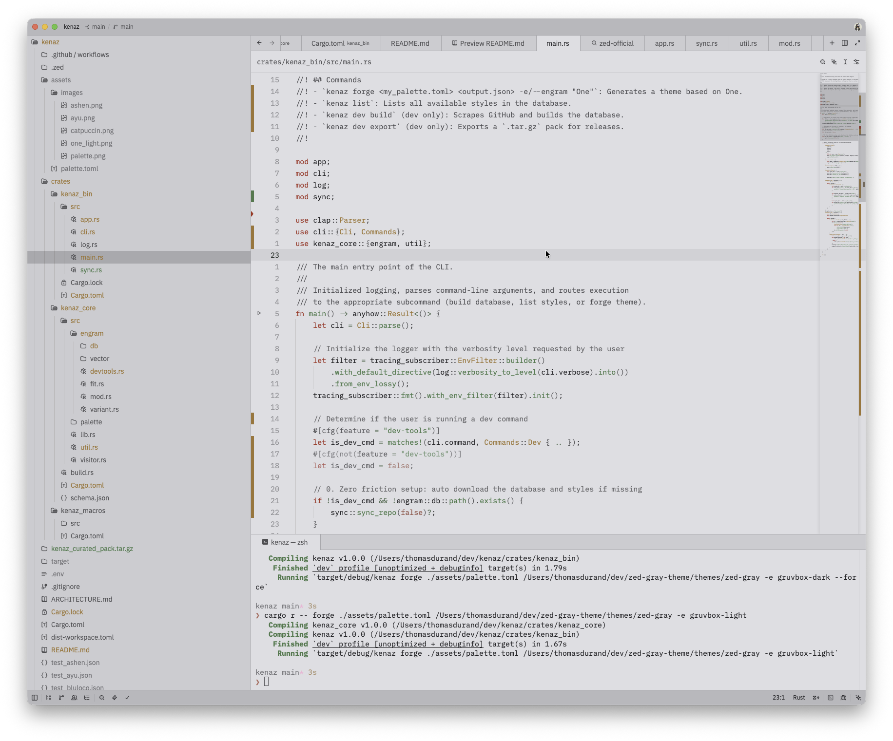
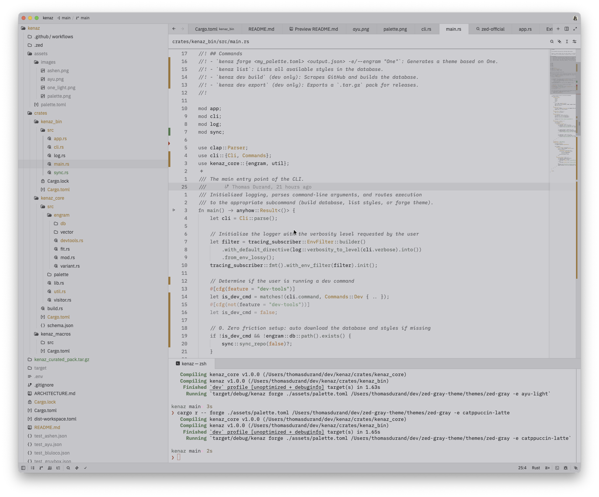
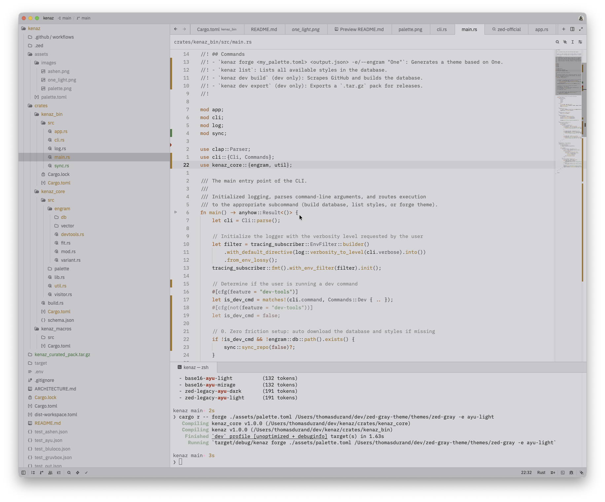
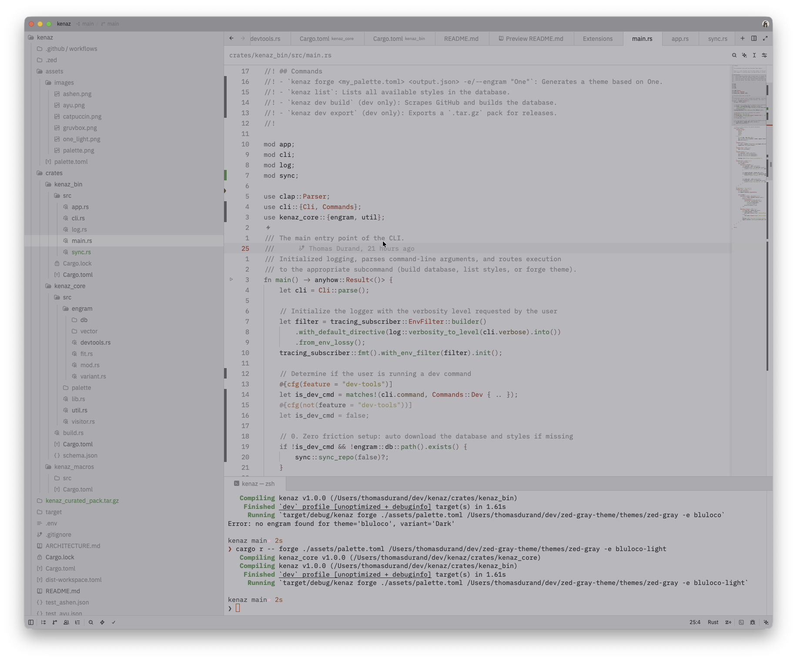

# Kenaz ⚒️

## The Editor Theme Forger

Kenaz is a CLI tool written in Rust that performs Style Transfer for editor themes. Instead of manually defining hundreds of color tokens for your custom theme, you provide a minimal 6-color palette, and Kenaz applies the mathematical DNA of existing themes to it.

## The Evolution: From ZTF to Kenaz

This project started as ZTF (Zed Theme Fixer), a simple script designed to fill in missing tokens in incomplete Zed themes. However, it quickly became apparent that guessing missing colors wasn't enough—we wanted to forge new themes from scratch.

The project was renamed Kenaz, after the Norse rune representing the torch, illumination, and the forge. It symbolizes bringing light and structure to colors. 

Furthermore, Kenaz is built to be editor-agnostic. While it currently targets Zed, the core architecture (engrams, Oklab math, SQLite persistence) is completely decoupled from the editor's schema. The vision is to expand to Helix, Neovim, and other editors in the future.

## Some examples


*Here is the Grim palette (the theme I wanted to create)*

Here you can see some examples with this palette and different engrams
<table>
    <tr>
        <td align="center"></td>
        <td align="center"></td>
    </tr>
    <tr>
        <td align="center"><b>Grim Ashen (Ashen Engram)</b></td>
        <td align="center"><b>Grim One Light (One Light Engram)</b></td>
    </tr>
    <tr>
        <td align="center"></td>
        <td align="center"></td>
    </tr>
    <tr>
        <td align="center"><b>Grim Gruvbox (Gruvbox Light Engram)</b></td>
        <td align="center"><b>Grim Catpuccin (Catpuccin Latte Engram)</b></td>
    </tr>
    <tr>
        <td align="center"></td>
        <td align="center"></td>
    </tr>
    <tr>
        <td align="center"><b>Grim Ayu (Ayu Light Engram)</b></td>
        <td align="center"><b>Grim Bluloco (Bluloco Light Engram)</b></td>
    </tr>
</table>

As you can see, you can have pretty different results for the same palette.
I thought that it would be interesting to have this functionality.
I primarily used light engrams for light themes, but you can use dark engrams as well. You should consider passing the `--force` argument, it will force kenaz to use the dark engram for your light palette and it will invert the engram vector.

## How it works

Kenaz doesn't just do a 1:1 color replacement. It performs Luminance-Only Style Transfer:
1. Extraction (kenaz dev build): Kenaz scrapes the Zed ecosystem, extracts the mathematical DNA (how each token relates to the 6 base anchor colors in the Oklab color space), and stores it in a local SQLite database.
2. Forging (kenaz forge): You provide a palette.toml with 6 colors (bg, fg, accent, success, warning, error). Kenaz loads a style's DNA from the database, finds the original theme's JSON to use as a "canvas", and recursively replaces the colors by applying the style's lightness deltas (delta_l) to your palette.
3. Result: A complete theme that respects your palette's identity (Hue/Chroma) while perfectly adopting the structural depth (shadows, popups, syntax contrasts) of the source theme.

## 🚀 Installation

### Using the installer (Recommended)
*(available since v1.0.0)*

#### Linux/MacOS
```bash
curl --proto '=https' --tlsv1.2 -LsSf https://github.com/reeves-48777/kenaz/releases/latest/download/kenaz-installer.sh | sh
```

#### Windows (PowerShell)
```powershell
powershell -ExecutionPolicy Bypass -c "irm https://github.com/reeves-48777/kenaz/releases/latest/download/kenaz-installer.ps1 | iex"
```

### From source (with Dev Tools)
```bash 
git clone https://github.com/reeves-48777/kenaz
cd kenaz
cargo build --release
```
*Note: On the first run, Kenaz will automatically download a lightweight "Curated Pack" containing the styles and the SQLite database. If you want to build the full database yourself from scratch, you can compile with the `dev-tools` feature: `cargo run --features dev-tools -- dev build`.*
 
## 🛠️ Usage
### 1. Define your palette

Create a `palette.toml` file:

```toml
[meta]
name = "MyTheme"

[[variants]]
name = "MyTheme Dark"
mode = "dark"

[variants.colors]
bg = "#1e1e2e"
fg = "#cdd6f4"
accent = "#89b4fa"
success = "#a6e3a1"
warning = "#f9e2af"
error = "#f38ba8"
```
 
### 2. Forge your theme

```bash  
kenaz forge palette.toml output.json --engram "One Dark"
```
 
### 3. Other commands

List all available styles in your database:
```bash
kenaz list
```

Download the full pack of 1300+ themes (power-users):
```bash
kenaz sync --full
```

Clean the local cache:
```bash
kenaz clean
```
 
## 🗺️ Roadmap

Kenaz is fully functional for V1, but here is what's planned for the future:
- [x] V1 - Core Engine: Oklab style transfer, SQLite persistence, proc-macro schema traversal.
- [x] V1.1 - Persistent Cache & Auto-Download: Pre-build the engrams.db for GitHub releases and auto-download it on first run (removing the need for users to compile with dev-tools).
- [ ] V2.0 - Terminal UI (TUI): Interactive interface using ratatui to browse styles, preview palettes, and generate themes without leaving the terminal.
- [ ] V2.1 - Database modification: Edit theme database (useful for my fellow developers)
- [ ] V2.2 - DataViz & Clustering: Run K-Means on the SQLite database to find "Meta-Styles" (e.g., generating a theme based on the mathematical average of all Dark themes).
- [ ] V3.0 - Editor Agnosticism: Expand the application to support Helix, Neovim and VSCode.

## 📖 Architecture

For a deep dive into the technical decisions (proc-macros, typify code generation, and Oklab math), please read the [ARCHITECTURE.md.](ARCHITECTURE.md)
